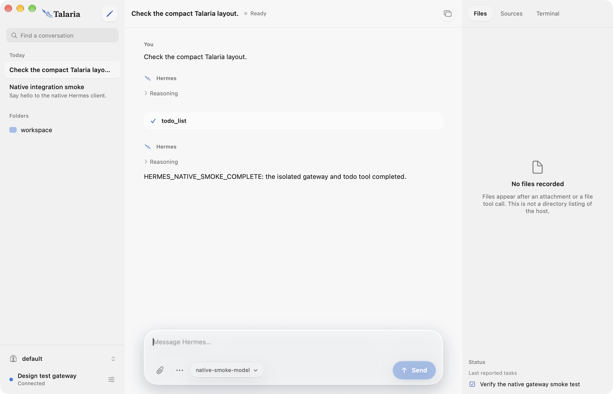
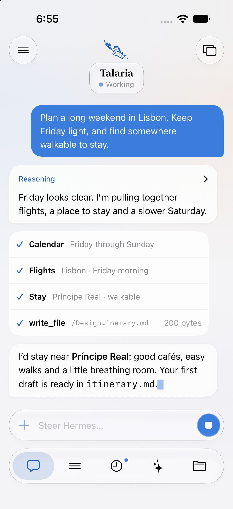

# Talaria


A SwiftUI Mac application and an iOS companion, backed by the existing Hermes Python agent.
This is an independent native client prototype. It is not an official Nous Research release.

Mac and iOS share one codebase, available under the [MIT license](LICENSE). See [contributor setup](CONTRIBUTING.md), [source release scope](PUBLIC_RELEASE.md), and [security reporting](SECURITY.md).

The current implementation covers native conversations, model selection, profile switching, file/image attachments and persistent text drafts. The iPhone workspace also shows scheduled-run updates and installed skills from your Hermes host. It is **not yet a full replacement for Hermes Desktop**. The complete roadmap and feature inventory are in [HERMES_NATIVE_PLAN.md](HERMES_NATIVE_PLAN.md).

| Mac | iPhone |
| --- | --- |
|  |  |

Actual native development builds using synthetic local test data. More [iPhone captures and verification details](IMPLEMENTATION_STATUS.md#current-iphone-verification) are available, including Sessions, Updates, approval with the native keyboard, dark appearance and larger text.

## Download the Mac preview

Download the universal Mac app from the [v0.1.1 preview release](https://github.com/howhowdg/talaria/releases/tag/v0.1.1). It requires macOS 14 or later and an existing Hermes installation or reachable gateway. The preview is ad hoc signed, not Developer ID signed or notarized, so macOS may block opening a downloaded copy. Building from source remains available below.

## Run the Mac app

```sh
git clone https://github.com/howhowdg/talaria.git
cd talaria
open Talaria.xcodeproj
```

Open `Talaria.xcodeproj` in Xcode, choose **TalariaMac**, and run. The checked-in project is generated from `project.yml`; regenerate it with `xcodegen generate` after changing targets.

Runtime targets: macOS 14+ and iOS 17+. Development uses Xcode 27 / Swift 6.4 for the current Liquid Glass UI and Icon Composer assets; this Xcode version requires a newer Mac host (the tested installation requires macOS 26.6+). No external Swift package dependencies are required. See [contributor setup](CONTRIBUTING.md) and [implementation status](IMPLEMENTATION_STATUS.md) for build requirements and verification limits.

```sh
xcodebuild -project Talaria.xcodeproj -scheme TalariaMac \
  -configuration Debug -derivedDataPath /tmp/talaria-native-build \
  CODE_SIGN_IDENTITY=- build
```

The app is at `/tmp/talaria-native-build/Build/Products/Debug/Talaria.app`. Build output lives outside the synced Documents folder because file-provider metadata can prevent code signing there.

Choose **Start local Hermes** to launch an existing Hermes installation using its default profile and provider configuration. Sending prompts uses that installation's configured provider. The app manages only the process it starts and stops it when you quit; closing the window leaves the app running. It does not install Python or Hermes yet.

Alternatively choose **Connect to a gateway** and enter a URL, profile, and gateway session token. Loopback HTTP and remote HTTPS are supported. Remote OAuth / Hermes Cloud login is not implemented yet. Tokens can be saved in the system Keychain; endpoint metadata is kept in the native app's own preferences. Agent/provider credentials stay on the host.

## iPhone and iPad

Choose the **TalariaIOS** scheme and an iOS simulator, or configure your development team to run on a device. The deployment target is iOS 17. The iOS app shares the actual client and native views with macOS and connects to a Hermes host; it does not run the Python agent on the phone. Use a reachable HTTPS endpoint on a physical device. The host continues the work when iOS suspends, and the app rehydrates session history on return. Background delivery and push notifications are future work.

The compact-width iPhone layout follows the [design handoff](Design/handoff/README.md): floating glass identity controls, a keyboard-aware composer, and Chat, Sessions, Updates, Skills and Files tabs. Chat uses native message bubbles and approval cards; Sessions adds search, date groups and a connection card. Regular-width iPad layouts retain the existing split-view interface. Typography follows Dynamic Type, with light/dark appearances and accessibility fallbacks.

Updates reads the host’s schedules and recent run summaries, and opens the actual conversation for review. Skills lists installed names and categories. Both are read-only and refresh when connecting, returning to the foreground or pulling to refresh. Files shows recorded conversation evidence, not a live host filesystem. Approval choices retain the host’s permission limits. You can draft a message while an approval waits, but sending or queueing a new prompt during a running turn, live steering, voice, schedule editing and skill management are not implemented.

## Implemented

- Native Liquid Glass controls and floating composer on current systems, adaptive light/dark accents, and a shared layered Talaria app icon. Older systems receive native material/button fallbacks. [Identity, assets and generation prompt](Design/Brand/README.md).
- Three-column Mac workspace with sidebar/tab navigation and recorded Files/Sources/Terminal inspector; floating iPhone workspace with Chat/Sessions/Updates/Skills/Files, session search, create/resume and persistent drafts.
- Read-only iPhone activity from real scheduled-run history and installed skills, with connection/profile scoping, seen-run badges and visible partial-load errors.
- Conversation-scoped model/provider selection, supported reasoning levels, provider catalog refresh and existing-profile switching.
- Native file picker, bounded file/image uploads, attachment progress/removal and interruption recovery.
- Token authentication, scoped profile routing, WebSocket JSON-RPC, readiness negotiation, heartbeat, cancellation/timeouts, bounded event delivery, explicit reconnect.
- Streaming assistant text and reasoning, tool cards, authoritative final text, backend interruption, restored conversation history.
- Native server-request controls for approval, clarification, secret entry, sudo and vault input.
- Keychain token storage and a Mac-only local runtime supervisor with readiness parsing and bounded shutdown.
- Pinned upstream OpenRPC contract with a generated exhaustive method/event catalog and focused Codable models.

Native Markdown supports inline formatting, headings, lists, quotes and fenced code while streaming. Tables, rich media, syntax highlighting, provider provisioning/accounts, broad preferences, projects/git, interactive terminals, browser control, plugins, skill/MCP management, schedule editing, voice and the other desktop subsystems remain on the roadmap. Session listing currently loads the latest 100 sessions. Existing profiles can be selected from the host; creating, editing and deleting profiles is not implemented.

New sessions use `source: "native"` until the client implements the desktop UI bridges. Unsupported UI server requests receive a method-not-supported error. Merely generating all RPC names does not implement their features.

Reconnect restores authoritative snapshots. It never automatically resends an uncertain prompt. Full replay-gap recovery, attachment leases, multi-client request settlement, long-history virtualization, offline storage and resilient background lifecycle still need the later roadmap work. Keep this preview to one active native client per session.

## Attachments and drafts

Use the paperclip in an idle conversation to choose files. This preview allows up to eight files, 20 MB each and 64 MB total. PNG, JPEG, GIF, WebP and BMP are supported as images; HEIC conversion, drag/drop and Photos import are future work. Document extraction depends on the Hermes host's installed readers.

Files are copied to `.hermes/native-attachments/<unique-id>/` inside the selected conversation's working directory on the host. Image bytes are staged in the host's image storage and added to the conversation only when you press Send. Removing a composer attachment does not delete its uploaded host file, so stored transcript references remain usable. Talaria shows the destination and rejects stale document references when the workspace changes.

Text drafts and the selected conversation survive relaunch in Talaria's private application-support directory, scoped by connection, profile and stored conversation ID. Attachments remain in memory and must be selected again after relaunch. A separate send journal records host image paths for recovery, without credentials or file bytes. An uncertain send is never replayed automatically. The pinned backend has a session-wide image queue, so use one active client per session until an atomic attachment-submit API is available.

## Verify

```sh
python3 scripts/generate-contracts.py --check
swift test --scratch-path /tmp/talaria-swift-build
```

The current handoff pass has 142 passing Swift tests, passing Mac/iOS simulator Debug builds and no pinned-contract drift. See [implementation status](IMPLEMENTATION_STATUS.md#current-iphone-verification) for the real-gateway checks and the limits of simulator visual verification.

`scripts/smoke-real-gateway.py` launches the pinned upstream Python server in a disposable home with a synthetic loopback OpenAI-compatible provider. It uses no real provider keys, runs a harmless todo tool cycle, and checks native-client reconnect and history. It requires the Hermes Python dependencies to already be installed; run `python3 scripts/smoke-real-gateway.py --help` for paths/options. Use `--native-runtime` to additionally verify that the Swift runtime manager starts and stops the real backend. Add `--extended` to verify session-only model changes, profile isolation and actual document/image delivery to the synthetic provider. The fixture blocks outbound Python networking and whitelists the subprocess environment. It is a test harness, not a replacement agent backend.

The standalone `hermes-smoke` executable can also exercise a configured gateway. It creates a session and sends a real prompt; set `HERMES_GATEWAY_TOKEN` in the environment rather than placing tokens in command arguments.

For repeatable phone design previews, the [synthetic iPhone fixture instructions](IMPLEMENTATION_STATUS.md#repeat-the-iphone-design-preview) use `scripts/fixtures/mobile_design_gateway.py` and `scripts/preview_ios_design.py`. This Debug-only path supplies sample data without real provider calls; it is separate from real Hermes integration testing.

## Layout

| Module | Responsibility |
| --- | --- |
| HermesProtocol | JSON-RPC wire types and pinned generated schema models |
| HermesTransport | Authenticated HTTP / WebSocket gateway client |
| HermesCore | Conversation/settings state, drafts, attachment transactions, app coordination, Keychain |
| HermesUI | Shared native SwiftUI interface |
| HermesMacServices | Mac-only runtime discovery and process ownership |
| Apps/macOS, Apps/iOS | Platform app entry points |
| Tests, scripts/fixtures | Protocol, transport, state, process and integration checks |

The source audit targets upstream commit `a566d20d226a8e2ef0747639dc8a3fc1c43f9dba`. The downloaded upstream checkout is ignored by Git; the pinned contract is included for reproducible generation. Preserve `ThirdPartyNotices.md` when distributing that schema or generated code.

## License and attribution

Talaria's original code and included artwork are distributed under the [MIT license](LICENSE). The Hermes gateway schema and generated code retain Nous Research's MIT notice in [ThirdPartyNotices.md](ThirdPartyNotices.md). Both notices are also bundled in the native apps. The backend remains the separate [Hermes Agent project](https://github.com/NousResearch/hermes-agent).
