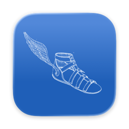
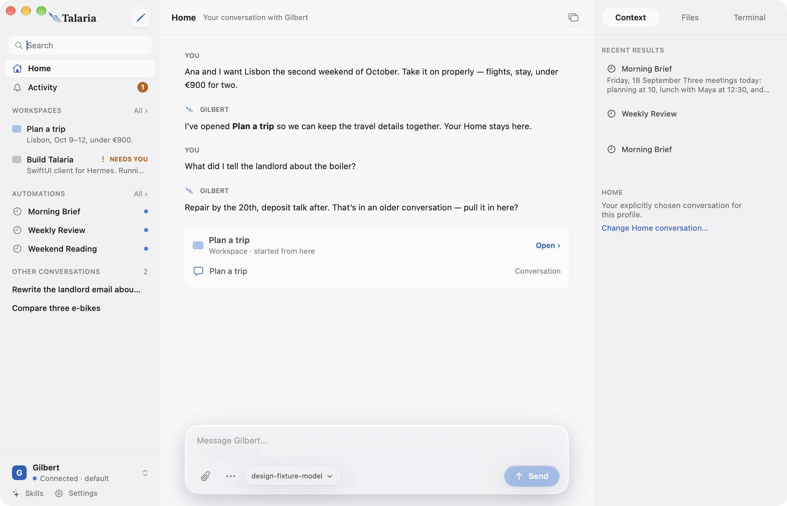

# Talaria



A native Mac and iPhone client for [Hermes](https://github.com/NousResearch/hermes-agent).

[Website](https://usetalaria.com/) · [Download for Mac](https://github.com/howhowdg/talaria/releases/download/v0.1.2/Talaria-0.1.2-macOS-universal.zip) · [Release notes](https://github.com/howhowdg/talaria/releases/tag/v0.1.2)

Talaria puts your conversations, workspaces, scheduled results and approvals in a shared SwiftUI interface. Connect to an existing Hermes installation on your Mac or a compatible remote gateway.



*Development build with sample conversations.*

## Your agent, organised

- **Home** — choose the conversation you always return to.
- **Workspaces** — group conversations around a project or area of work.
- **Automations** — read scheduled results, inspect run history, and pause, resume or run existing automations.
- **Activity** — see unread results and requests that need your decision, with a path back to their conversation.

Talaria supports streaming replies, native Markdown, file and image attachments, persistent text drafts, model selection and existing Hermes profiles. Approval controls preserve the choices allowed by your host. Optional [Telegram topic import](docs/telegram-topics.md) connects selected topics to Home or Workspaces.

## Download

**[Talaria 0.1.2 for Mac](https://github.com/howhowdg/talaria/releases/download/v0.1.2/Talaria-0.1.2-macOS-universal.zip)** supports Apple silicon and Intel on **macOS 14 or later**. The app is Developer ID signed and notarized by Apple. [Release notes and checksums](https://github.com/howhowdg/talaria/releases/tag/v0.1.2) accompany the download.

Unzip the archive, move `Talaria.app` to Applications, and open it. Choose **Start local Hermes** for an existing local installation, or **Connect to a gateway** for a compatible endpoint and session token. Talaria does not install or bundle Hermes or Python; your Hermes host provides the model and agent runtime.

The iPhone app is available as **source only**, targeting **iOS 17 or later**. It connects to a Hermes host and does not run the agent on the phone. No installable iOS release is published yet.

## Preview status

Talaria is an early preview. Workspace organisation is stored on each device; it does not sync across devices. Files and Terminal show recorded conversation evidence, rather than a live filesystem or interactive shell. Voice, push notifications, automation editing and broader Hermes Desktop features are not available yet.

Use one active sending client per session during this preview. See [current capabilities and limitations](docs/status.md) for compatibility and reliability details.

## Build from source

Source builds support Hermes username/password sign-in on Mac and iOS. Select **Username & password**; **Remember sign-in** saves the session in device-only Keychain, not the password. On Mac, select **SSH** and paste `user@host`. Talaria uses this Mac's SSH key or agent and `~/.ssh/known_hosts`, starts a private Hermes gateway on the SSH host, and obtains its session token automatically. **Advanced → Use running gateway** instead connects to a gateway already listening on a chosen port and path; that gateway may require its own sign-in. Direct remote URLs use HTTPS or a Tailscale 100.64.0.0/10 HTTP address. The 0.1.2 download above supports session tokens only.

Development uses **Xcode 27 / Swift 6.4**. The checked-in project has no external Swift package dependencies.

```sh
git clone https://github.com/howhowdg/talaria.git
cd talaria
open Talaria.xcodeproj
```

Choose **TalariaMac** and run, or choose **TalariaIOS** with an installed simulator. Running on an iPhone requires your own development signing configuration.

For toolchain requirements, command-line builds and tests, see [Contributing](CONTRIBUTING.md). The [architecture guide](docs/architecture.md) describes the shared packages, and the [Mac distribution guide](docs/mac-distribution.md) covers release packaging.

## Contributing

Bug reports and focused improvements are welcome. Include reproduction steps and redacted diagnostics in [GitHub issues](https://github.com/howhowdg/talaria/issues), and use synthetic data in screenshots. See [Contributing](CONTRIBUTING.md) before opening a pull request and [Security](SECURITY.md) for private vulnerability reports.

## License

Talaria's original code and artwork use the [MIT license](LICENSE). The Hermes schema and generated code retain Nous Research's notice in [ThirdPartyNotices.md](ThirdPartyNotices.md); both notices are bundled in the apps.

Talaria is an independent project, not an official Nous Research release. The agent runtime is maintained separately in [Hermes Agent](https://github.com/NousResearch/hermes-agent).
